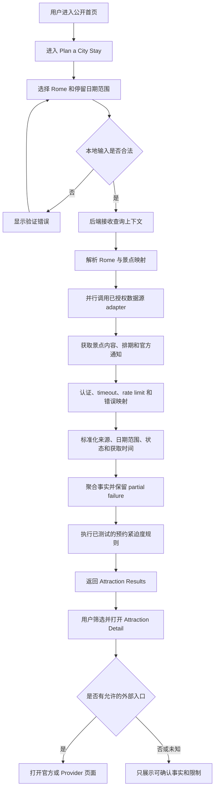

# 产品需求与用户流程

状态：MVP 开发范围已冻结 v0.6
最后更新：2026-08-22

## 1. 文档目的

本文档用于统一项目的产品目标、MVP 页面、业务逻辑、数据状态和端到端 workflow。它先回答“产品应该怎样工作”，再指导后续 coding。

当前开发范围已经依据 Google Places 和 Viator Basic Access Sandbox 的实际验证结果冻结。Production 票务展示仍然是独立 release gate。本文档继续明确区分：

- **已确定**：不依赖具体 Provider 权限，可以作为稳定产品原则。
- **候选方案**：适合作为第一版设计，但需要在开发前确认。
- **等待验证**：必须依据 Viator、Tiqets 或其他正式授权结果决定，不能提前假设。

## 2. 产品定位

### 2.1 一句话说明

这是一个面向欧洲自由行游客的城市景点规划与预约决策工具。用户输入将在某座城市停留的日期范围后，系统帮助发现值得关注的景点，判断哪些景点需要优先预约，并说明开放状态、票务证据、来源和不确定性。

### 2.2 产品解决的问题

自由行用户通常需要在多个景点页面和票务平台之间反复查询，但仍然难以回答：

1. 我在 Rome 停留的这几天有哪些主要景点？
2. 哪些景点最热门、评价较高，相关依据是什么？
3. 哪些景点需要提前处理，大致紧迫到什么程度？
4. 在整个停留日期范围内，哪些日期或时段存在可确认的票务排期？
5. 景点是否正常开放，是否存在可追踪的临时关闭或施工通知？
6. 我应该去景点官网还是合作票务平台继续查看或购买？
7. 当数据缺失或 Provider 失败时，当前到底是“无票”还是“无法确认”？

本产品的价值不是简单堆积票务列表，也不是代替用户自动生成完整行程，而是把城市停留范围、景点热度、开放信息、预约紧迫度、票务入口、来源、新鲜度和不确定性整理成可理解的决策信息。

### 2.3 第一版范围

- 第一座城市：Rome。
- 第一批景点：10 个已经确认的核心景点或景点组合，13 个 Google Place ID 已完成初次映射，票务 Provider 产品映射仍需逐项核对。
- 第一条真实数据链路：只接入一个已验证 Provider。
- 第一版用户无需注册即可查询。
- 第一版不在本站收款或出票，购买发生在 Provider 允许的页面。
- 第一版 Web App 同时支持桌面和手机浏览器。
- 第一版输入是城市停留日期范围，而不是要求用户先确定每个景点的准确游览日。
- 第一版核心输出是景点清单和预约紧迫度，不是最低票价排行榜。
- 第一版计划接入 Google Maps Platform，在结果页提供 Rome 景点地图，并使用 Places API 获取经过授权的景点级位置和基础事实。

### 2.4 Rome MVP 首批景点

以下清单已于 2026-08-19 确认。这里的“组合”表示用户通常会在同一次规划中一起考虑的地点，不代表 Google Places 或票务 Provider 一定只返回一个外部实体。外部映射必须逐项保存，不能根据名称猜测 Place ID 或产品 ID。

| 内部候选标识 | English name | 中文名称 | MVP 说明 |
| --- | --- | --- | --- |
| `colosseum-archaeological-park` | Colosseum, Roman Forum and Palatine Hill | 罗马斗兽场、古罗马广场和帕拉蒂尼山 | 一个规划组合，Google 和票务映射可能包含多个外部实体 |
| `vatican-museums-sistine-chapel` | Vatican Museums and Sistine Chapel | 梵蒂冈博物馆和西斯廷教堂 | 一个规划组合，地理位置属于 Vatican City，但纳入 Rome 行程范围 |
| `st-peters-basilica` | St. Peter's Basilica | 圣彼得大教堂 | 地理位置属于 Vatican City，但纳入 Rome 行程范围 |
| `pantheon` | Pantheon | 万神殿 | 独立景点 |
| `borghese-gallery` | Borghese Gallery | 博尔盖塞美术馆 | 独立景点 |
| `castel-sant-angelo` | Castel Sant'Angelo | 圣天使堡 | 独立景点 |
| `capitoline-museums` | Capitoline Museums | 卡比托利欧博物馆 | 独立景点 |
| `baths-of-caracalla` | Baths of Caracalla | 卡拉卡拉浴场 | 独立景点 |
| `domus-aurea` | Domus Aurea | 尼禄金宫 | 独立景点 |
| `trevi-fountain` | Trevi Fountain | 特莱维喷泉（许愿池） | 外围观看免费，游客进入内部围合区域需购买官方 €2 门票；必须把两种访问范围分开 |

本清单冻结产品范围。Google Place ID 初次映射记录在 [`rome-attraction-catalogue.md`](rome-attraction-catalogue.md)；地址、坐标、Maps URI 和其他 Places 字段在运行时获取。票务产品覆盖需要通过已经验证的 Provider 响应单独建立映射。

### 2.5 当前不做

- 本站支付、订单、退款和出票。
- 完整账号、JWT、社交登录和个人资料。
- 多城市全面覆盖。
- 未获授权的跨 Provider 价格比较。
- 邮件、短信和推送提醒。
- 复杂行程协作或多人共享。
- 已购景点勾选、拖拽排程和可视化日历。
- 没有正式授权来源的按小时人流预测或实时拥挤度。
- 未经条款审查的通用网页抓取。
- AI 自由生成票价、余票、规则或预约优先级。
- 微服务、Kafka 或 Kubernetes。

### 2.6 功能优先级

| 层级 | 功能 |
| --- | --- |
| MVP 必须完成 | Rome 日期范围输入、约 10 个景点、列表与 Google Map 联动、评分与热度信号、预约紧迫度、日期范围排期摘要、开放或关闭信息的来源、官方与 Provider 跳转、未知和失败状态 |
| 有可靠数据才加入 | 按时段人流量、实时拥挤度、自动临时关闭通知、精确“提前几天购买”、跨 Provider 比较 |
| 后续扩展 | 已购勾选、拖拽式日程、路线与可视化日历、账号保存、提醒、移动端原生 App |

## 3. 目标用户和使用场景

### 3.1 核心用户

正在规划欧洲自由行、希望自己安排景点和门票的个人游客。

典型特点：

- 已经确定或大致确定旅行城市和日期。
- 不熟悉当地景点的预约难度。
- 不希望在很多网站之间反复查找和比较。
- 更在意信息是否可信，而不是看到大量未经解释的推荐。
- 可能在电脑上完成详细规划，也可能在手机上快速查看。

### 3.2 核心 Job to Be Done

> 当我知道自己会在一段日期内停留 Rome，但还没有安排每一天的景点时，我希望快速知道有哪些景点值得考虑、哪些需要优先预约、哪些日期可能有票，以及下一步应该去哪里查看或购买。

### 3.3 主要使用场景

#### 场景 A：旅行前集中规划

用户在电脑上选择 Rome 和停留日期范围，查看景点决策列表，再进入具体景点比较这几天内的排期、预约紧迫度、开放信息和票务入口。

#### 场景 B：临时查看

用户在手机上快速确认某个景点是否需要尽快预约、是否有关闭提示，以及数据是否足够新。

#### 场景 C：Provider 部分失败

某个外部请求失败时，用户仍然能看到已经成功返回的事实，并明确知道哪些内容当前无法确认。

## 4. 核心产品原则

以下原则已经确定：

1. 每条票务事实必须保留 Provider、Provider 产品标识和获取时间。
2. `Unknown`、`Request failed` 和 `Sold out` 必须是不同状态。
3. Sandbox、fixture、人工维护和 production 数据必须清楚区分。
4. 未验证含义的字段不进入公开 UI。
5. 价格必须同时显示币种和价格适用范围，不能只显示一个数字。
6. Provider 不支持的字段显示 `Not supported` 或 `Unknown`，不能由 AI 补全。
7. 单个 Provider 失败不能把整个请求伪装成“没有结果”。
8. Provider key 只保存在后端 secret 中，不能进入前端 bundle、日志或 Git。
9. AI 只能解释经过验证的结构化事实和确定性规则。
10. README、公开页面和简历描述必须与真实权限和实现状态一致。

## 5. MVP 信息架构

### 5.1 页面清单

| 页面 | 路由候选 | MVP 状态 | 主要目的 |
| --- | --- | --- | --- |
| Public Home | `/` | 已存在 | 解释产品问题、范围和当前状态 |
| Methodology | `/methodology` | 已存在 | 解释来源、新鲜度、未知状态和 AI 边界 |
| Plan a City Stay | `/plan` | 10A 已完成 | 收集 Rome 和最长 14 天的停留日期范围 |
| Attraction Results | `/results` | Rome Booking Priority MVP 已完成本地实现；地点与 Sandbox 票务覆盖仍为部分映射 | 按预约优先级展示 10 个景点，并分开展示官方、地点和第三方票务证据 |
| Attraction Detail | `/attractions/:attractionId` | 待开发 | 展示位置、日期范围内的开放、排期、证据和跳转入口 |
| Saved Trip | `/trips/:tripId` | 后续 | 保存和重新打开行程，不属于首个纵向切片 |

第一版只需要前五个页面，其中 Home 和 Methodology 已经完成。Saved Trip 不应阻塞真实查询 MVP。

## 6. 页面需求

### 6.1 Public Home

当前职责：

- 一分钟内解释产品解决什么问题。
- 说明 Rome-first 范围。
- 清楚展示当前是否已经接入真实数据。
- 提供进入 Methodology 和产品查询流程的入口。

Provider 接入后需要调整：

- 将 `Pre-API phase` 更新为真实且准确的当前阶段。
- 只有真实纵向切片上线后才显示 `Plan a Rome visit` 主按钮。
- 不在首页直接展示未经用户选择日期的价格或余票。

### 6.2 Methodology

当前职责：

- 解释一条事实需要来源、含义、允许用途和时间信息。
- 解释 `Verified`、`Unavailable`、`Unknown`、`Stale` 和 `Request failed`。
- 说明 AI 不能创造票务事实。

Provider 接入后需要补充：

- 当前已连接的 Provider 和 access level。
- Sandbox 与 production 的清楚标识。
- 经过验证的缓存和 freshness 规则。
- Provider attribution 要求。

### 6.3 Plan a City Stay

#### 页面目标

用最少输入建立查询上下文，不让用户先面对大量票务列表。

#### MVP 内容

- 城市选择：第一版只开放 Rome，其他城市显示为后续计划或不显示。
- 到达日期和离开日期：必填，形成城市停留范围。
- 页面需要说明：用户不必现在决定每个景点的准确游览日。
- 游客数量或年龄段：仅当首个 Provider 的价格查询确实需要且允许时加入。
- 币种：默认根据产品范围选择 EUR，是否允许切换等待 Provider 字段验证。
- `Find attractions` 按钮。
- 数据来源和当前环境的简短说明。

#### 交互规则

- 不允许选择过去日期，离开日期必须晚于或等于到达日期。
- MVP 建议先把一次查询限制为最多 14 个自然日，最终上限需要用户确认。
- 可查询的最远日期由 Provider 实际 booking window 决定，不预设虚假范围。
- 输入错误在本页直接说明，不发送 Provider 请求。
- 提交后 URL 应保留可分享的非敏感查询条件，例如 city、stayStartDate 和 stayEndDate。
- 不把用户输入发送给无关的第三方服务。

#### 页面状态

- Initial。
- Validation error。
- Submitting。
- Provider unavailable。
- No supported attractions。

### 6.4 Attraction Results

#### 页面目标

帮助用户在还没有排好每天行程时，先理解 Rome 有哪些景点、哪些最值得关注，以及哪些票务事项需要优先处理。

#### 页面头部

- 城市与停留日期范围。
- 修改查询入口。
- 数据环境，例如 `Sandbox` 或 `Live`。
- 最近一次获取时间。
- 当前 Provider 和部分失败提示。

#### 地图与列表联动

- 桌面端默认同时显示景点列表和 Rome 地图；移动端提供 `List` 与 `Map` 切换。
- 地图只显示当前筛选结果，marker 使用内部景点标识关联列表卡片。
- 点击 marker 时突出对应景点卡片；点击卡片时让地图聚焦对应 marker。
- 地图 marker 不自行表达预约紧迫度事实，颜色和图标只使用已经计算完成的内部状态。
- 地图加载失败时列表仍然可用，不能让 Google Maps 故障阻断核心查询。

#### 景点决策卡片

每张卡片至少包括：

- 景点名称。
- 预约紧迫度和置信度。
- 一句话确定性解释，例如“官方要求预约”或“当前证据不足，无法判断”。
- 评分和评分数量，仅在来源、展示条款和更新时间明确时出现。
- 可解释的热度信号，例如评分数量，不能伪装成真实访客量。
- 日期范围内的排期摘要，例如“5 个停留日中有 4 天存在已发布排期”。
- 开放时间摘要和临时关闭提示，仅在来源足够可靠时出现。
- 官方网站入口和允许的 Provider 票务入口。
- 所有关键事实的来源。
- 获取时间或 freshness。
- `View details` 入口。

#### 决策状态候选

以下是第一版已经实现的 UI 标签：

- `Book first`（先订）：官方明确要求预约时段，用户在确定停留日期后应优先处理。
- `Book soon`（尽快订）：官方明确建议提前预约，但当前证据不足以声称一定会售罄。
- `Can wait`（可以等等）：官方明确说明无需提前预约、普通入场免费，或付费范围属于可选项目。
- `Check official source`（查看官方信息）：需要门票，但官方核对结果不足以支持可靠的时间建议。内部安全状态仍为 `UNKNOWN`。

每个标签必须同时显示置信度、可读依据、官方来源、核对日期、规则版本和计算时间。Viator Sandbox 排期或价格不能改变官方预约优先级。

#### 筛选和排序

MVP 候选筛选器：

- 预约紧迫度。
- 评分区间。
- 有无临时关闭提示。
- 景点类别，例如 museum、historic site 或 religious site。
- 停留日期范围内是否存在已发布票务排期。

MVP 候选排序：

- `Recommended`：先按预约紧迫度，再按证据完整度排序。
- `Most reviewed`：按同一来源的评分数量排序，标签不得写成“实时客流”。
- `Highest rated`：必须设置最低评分数量门槛，避免少量评价导致误导。
- `Booking urgency`：按确定性规则结果排序，`Unknown` 放在末尾。

按小时人流量、实时拥挤度和“最少人时段”暂不进入 MVP，因为当前已核对的正式 API 没有提供可直接使用的字段。

#### 排序规则

默认顺序候选：

1. 有明确、可解释优先级的景点。
2. 有当前票务事实但优先级未知的景点。
3. 数据未知或请求失败的景点。

不能按照 AI 生成分数排序。价格排序和跨 Provider 排序必须等比较条款确认。

#### 列表级状态

- Loading skeleton。
- Complete result。
- Partial result。
- All providers failed。
- No mapped attractions。
- Request validation failed。

### 6.5 Attraction Detail

#### 页面目标

让用户理解单个景点的证据，并在允许时前往 Provider 完成购买。

#### 页面内容

- 景点名称和基础位置。
- 小型位置地图、地址和 `Open in Google Maps` 入口。
- 所选停留日期范围和修改日期入口。
- 日期范围日历摘要，表达哪些日期有已发布排期、哪些日期未知。
- 预约紧迫度、置信度和规则依据。
- 评分、评分数量和它们的来源。
- 常规开放时间、未来七天特殊开放时间或临时关闭状态，仅在数据范围适用时显示。
- 可追踪的官方通知。每条通知包括标题、来源 URL、发布日期或抓取时间、适用日期和验证状态。
- 当前事实状态。
- Provider 产品或票务选项列表。
- 经过验证的价格、币种和价格条件。
- schedule 或 availability 的准确含义。
- 取消或入场规则，仅在 Provider 明确返回且允许展示时出现。
- Provider 名称、来源链接、获取时间和 freshness。
- Sandbox 或 live 标识。
- 允许的购买或查看入口。

#### 购买跳转规则

- 使用 Provider 返回的 affiliate URL，不自行拼接或删除 tracking 参数。
- 明确告诉用户购买将在 Provider 网站完成。
- 第一版不保存支付信息，也不处理订单。
- 跳转前不把未知状态描述为可预订。
- 官方网站和 Provider 可以同时展示，但必须清楚标记 `Official site` 与 Provider 名称。
- Google Maps 入口使用 API 返回的正式 URI 或符合 Maps URLs 规范的链接，不自行伪造 Place ID。

#### 错误表达

- Provider 明确无可用选项：显示 `Unavailable`。
- Provider 没有提供相关字段：显示 `Not supported`。
- 请求失败：显示 `Unable to confirm`，并保留重试入口。
- 缓存数据超过允许时间：显示 `Stale`，不能当作当前状态。

## 7. 端到端用户 workflow



## 8. 后端业务 workflow

### 8.1 请求阶段

1. 前端提交 city、stayStartDate、stayEndDate、locale 和允许的旅客条件。
2. 后端验证格式和支持范围。
3. `trip` 模块表达本次旅行上下文。
4. `attraction` 模块解析内部景点标识与 Provider 标识映射。

### 8.2 Provider 阶段

1. `provider` 模块选择已经授权的数据源 adapter，包括票务 Provider 和未来可能加入的官方通知来源。
2. adapter 从后端环境变量读取 key。
3. adapter 调用对应 Sandbox 或 production base URL。
4. 原始 DTO 留在 provider internal 范围。
5. adapter 将 HTTP、认证、429、timeout 和 Provider 错误转换成内部状态。
6. 每个结果保留 Provider、产品标识、环境和获取时间。

### 8.3 标准化与聚合阶段

1. `availability` 接收日期范围内的标准化票务排期结果。
2. 区分 `AVAILABLE`、`UNAVAILABLE`、`UNKNOWN`、`STALE`、`REQUEST_FAILED` 和 `NOT_SUPPORTED`。
3. `attraction` 聚合景点内容、评分信号、开放信息和官方通知，但保留每个事实的原始来源。
4. 根据 Provider 条款决定是否读取或写入 Redis 缓存。
5. 多来源阶段保留每个来源的独立错误，不用一个错误覆盖全部结果。

### 8.4 决策与解释阶段

1. `bookingpriority` 只运行有来源、有测试的确定性规则。
2. 规则可以读取官方预约要求、停留日期距离、已发布票务排期和经过验证的历史观察，但不能只因“热门”就断言会售罄。
3. 无充分证据时返回 `UNKNOWN`，而不是给出猜测优先级。
4. `aiexplanation` 未来只能把输入事实和规则结果转换成自然语言。
5. AI 不得改变状态、价格、时间、来源或优先级结果。

## 9. 核心状态模型

| 内部状态 | 用户含义 | 可以显示为售罄吗 | 是否允许 AI 补全 |
| --- | --- | --- | --- |
| `VERIFIED_AVAILABLE` | Provider 返回可用事实 | 否 | 否 |
| `VERIFIED_UNAVAILABLE` | Provider 明确返回不可用 | 是，但必须保留来源和时间 | 否 |
| `UNKNOWN` | 信息不足，无法回答 | 否 | 否 |
| `NOT_SUPPORTED` | 当前 access level 不提供该字段 | 否 | 否 |
| `STALE` | 数据超过允许 freshness | 否 | 否 |
| `REQUEST_FAILED` | Provider 请求失败 | 否 | 否 |
| `PARTIAL` | 部分来源成功、部分失败 | 否 | 否 |

最终枚举名称可以在 Part 8 调整，但这些语义区别不能合并。

## 10. 候选 API 交互

以下只描述产品需要的数据，不冻结具体 REST 设计：

### 10.1 查询输入

```json
{
  "city": "ROME",
  "stayStartDate": "YYYY-MM-DD",
  "stayEndDate": "YYYY-MM-DD",
  "currency": "EUR",
  "locale": "en-IE"
}
```

### 10.2 查询输出需要表达

- 查询上下文。
- 数据环境。
- 景点内部标识和展示名称。
- Google Place ID、经纬度、地址和 Google Maps URI。
- 评分、评分数量、开放信息和官方通知及各自来源。
- Provider 与 Provider 产品标识。
- 标准化事实状态。
- 日期范围内逐日排期摘要。
- 价格、币种和价格语义。
- 官方 URL 和允许的购买 URL。
- 获取时间和 freshness。
- Provider 错误和 partial failure。
- 经过测试的预约紧迫度、置信度及其规则依据。

具体 endpoint、DTO 和字段只在 Viator Sandbox 验证完成后进入 Part 8 契约设计。

## 11. 非功能需求

### 11.1 数据真实性

- 每个事实可追踪到正式来源。
- UI 不把 Sandbox 描述为 live。
- 日志不得输出 API key 或完整敏感 header。
- 无数据不能转化为肯定结论。

### 11.2 可用性

- 桌面和手机完成同一核心查询。
- 键盘可以完成表单、结果导航和重试。
- Loading、empty、error 和 partial 状态都有可见反馈。
- 状态不能只依赖颜色表达。

### 11.3 性能与韧性

- Provider timeout、retry 和 circuit breaker 按来源隔离。
- Retry 只用于安全且符合条款的请求。
- 429 遵守 Provider rate-limit headers。
- 缓存只在条款允许范围内使用。
- Places API 请求使用精确 FieldMask，只读取页面实际需要的字段。
- Google Maps 或 Places 失败时保留票务列表和其他来源事实，并标记地图或景点级数据暂不可用。
- 第一条纵向切片先测量实际响应时间，再设置用户体验目标。

### 11.4 隐私与安全

- 第一版不收集用户账号和支付信息。
- 查询参数不得包含 secret 或个人敏感信息。
- Provider key 和服务端 API key 只存在于本地后端环境或后端托管 secret。
- 前端不能直接调用需要 secret 的 Provider API。
- Maps JavaScript API 使用单独的浏览器 key，只允许 localhost 和正式部署域名，并限制为 Maps JavaScript API。
- Places API 使用独立的服务端凭据，只允许 Places API；不得把服务端 key 放入 Vite 环境变量或前端 bundle。
- Google Cloud 开启 billing 后必须配置预算提醒、API quota 和使用量监控。预算提醒不是硬性停机机制，因此仍需设置 quota。

## 12. 数据可行性与 MVP 边界

### 12.1 评分与“热门”

- Viator product content 可以提供产品评分与评论数量，但它表示 Provider 产品表现，不等于景点真实访客量。
- Google Places API 当前正式字段包含 `rating` 和 `userRatingCount`，可以作为候选景点级信号，但接入前仍需评估费用、缓存、attribution 和展示条款。
- MVP 可以使用 `Most reviewed` 和 `Highest rated`，但必须标明数据来源。
- MVP 不使用模糊的“最多人去”标签，除非未来获得真实访客量或经过授权的排名数据。

### 12.2 开放时间与临时关闭

- Google Places API 当前正式字段包含 `regularOpeningHours`、未来七天的 `currentOpeningHours` 和 `businessStatus`。`businessStatus` 能表达 `CLOSED_TEMPORARILY`，但不能代替景点官网的施工原因或长期公告。
- 对超过未来七天的旅行日期，只能把常规开放时间作为参考，不能描述为已确认的特殊开放时间。
- 景点施工、临时闭馆和特殊入场规则优先使用景点官方 API、RSS、公告页或人工验证记录。
- 自动抓取官方网页不属于首个 MVP。未来如需加入，必须先检查网站条款与 robots 规则，并通过独立 adapter 保存来源 URL、抓取时间、内容指纹、适用日期和解析状态。
- 不抓取 Viator、Tiqets 或其他票务平台网页来绕过 API 权限。

### 12.3 人流量与按时段拥挤度

- Google Places API 当前公开字段目录没有 Popular Times、实时拥挤度或逐小时客流字段。
- Provider 的评分数量、售票排期和售罄日期都不能直接冒充现场人流量。
- 因此按时段人流图、最少人时段和实时拥挤度属于条件功能，只有获得合法、稳定且含义清楚的数据源后才能进入公开 UI。

### 12.4 预约紧迫度

预约紧迫度是本产品的核心计算结果，但必须是可解释的确定性规则，不是 AI 猜测。候选证据按可靠性排序：

1. 景点官网明确写出的预约要求、放票窗口或售票限制。
2. 已授权 Provider 返回的具体日期排期和明确不可用日期。
3. 本系统在条款允许时保存的历史观察，例如相同景点未来 7、14、30 天的可用日期比例。
4. 季节、周末和评分数量只能作为辅助背景，不能单独产生 `Book first`。

候选输出：

| 输出 | 含义 | 最低要求 |
| --- | --- | --- |
| `Book first` | 官方明确要求预约时段，日期确定后优先处理 | 人工核对的官方政策和自动化测试 |
| `Book soon` | 官方建议提前预约，但不能保证会售罄 | 人工核对的官方建议和自动化测试 |
| `Can wait` | 官方规则支持较低紧迫度 | 需要正面证据，不能仅因为数据缺失 |
| `Check official source` | 无法可靠给出购买时间建议 | 默认安全状态，内部值为 `UNKNOWN` |

每个结果同时返回：规则版本、证据列表、置信度、计算时间和数据新鲜度。除非官方政策或经过验证的历史数据明确支持，否则 UI 不给出“必须提前 14 天购买”这类精确数字。

### 12.5 Google Maps Platform 接入边界

第一版计划使用两个独立能力：

| 能力 | MVP 用途 | 不负责 |
| --- | --- | --- |
| Maps JavaScript API | Rome 地图、景点 marker、列表与地图联动 | 票务状态、预约紧迫度和真实客流 |
| Places API (New) | Place ID、经纬度、地址、Google Maps URI、官网、评分、评分数量、开放时间和 business status | Popular Times、现场拥挤度和施工原因 |

实现约束：

- 内部 `Attraction` 继续是主实体，Google Place ID 只是外部来源映射，不能让 Google DTO 进入业务模块。
- 可以长期保存 Place ID，但 Google 建议对超过 12 个月的 Place ID 进行刷新。
- Places content 的缓存、展示和 attribution 必须遵守当前政策；除允许例外外，不能把响应当作永久自有数据存储。
- 如果 Places 数据显示在地图上，使用 Google Map 并保留自动 attribution；如果脱离地图展示，必须按政策显示 Google Maps attribution。
- 网站需要公开 Terms of Use 和 Privacy Policy，并纳入 Google 要求的条款链接。
- Google Maps Platform 需要启用 billing。地图加载与不同 Places 字段可能触发不同 SKU，因此 production 不使用 `*` FieldMask。
- Routes API 不进入 MVP。它以后可以为图形化行程提供景点间通行时间，但不能阻塞当前景点发现和预约决策。

### 12.6 已核对的正式技术来源

- [Viator Partner API technical documentation](https://docs.viator.com/partner-api/technical/)
- [Google Places API place data fields](https://developers.google.com/maps/documentation/places/web-service/data-fields)
- [Google Places API place resource](https://developers.google.com/maps/documentation/places/web-service/reference/rest/v1/places)
- [Google Maps Platform API security best practices](https://developers.google.com/maps/api-security-best-practices)
- [Places API policies and attribution](https://developers.google.com/maps/documentation/places/web-service/policies)
- [Google Maps Platform pricing](https://developers.google.com/maps/billing-and-pricing/pricing)
- [Google Place IDs](https://developers.google.com/maps/documentation/places/web-service/place-id)

这些链接用于确认技术能力。项目已经决定接入 Google Maps Platform，但具体字段、缓存方式和页面展示仍必须遵守其 pricing、security、display 和 attribution 条款。

## 13. Provider 验证后才能决定的问题

### Viator

- Sandbox key 激活后的实际 access level 和 endpoint 响应。
- Rome 的正式 destination ID 和目标景点覆盖。
- Basic Access schedule 的准确日期、价格和 availability 语义。
- 实际 rate-limit headers。
- Sandbox 与 production 数据差异。
- Product URL 的 attribution 和页面展示要求。
- Production key 和 contact details 的要求。

### Tiqets

- Affiliate 申请是否成功收到及审核结果。
- Essential API token 是否默认开放。
- Content、Availability 和 Pricing 的实际字段。
- Rome 覆盖、缓存、图片 credit 和 attribution 要求。
- 是否允许与 Viator 在同一页面展示或比较。

### Google Maps Platform

- Google Cloud 项目的 EEA 条款、billing account 和预算策略。
- 约 10 个 Rome 景点的 Place ID 映射准确性。
- Maps JavaScript API 浏览器 key 的 localhost 和 Vercel referrer restrictions。
- Places API 服务端凭据、部署环境限制和最小 FieldMask。
- 评分、开放时间、business status、缓存和 attribution 的实际展示方案。
- Terms of Use 和 Privacy Policy 页面要求。

### 产品规则

- 已确认的 10 个 Rome MVP 景点与 Provider 产品 ID 的准确映射，以及 Google Place ID 的定期复核。
- 景点名称和基础内容的授权来源。
- `Book first`、`Book soon`、`Can wait` 和 `Check official source` 的事实依据，以及未来精确提前天数所需的历史观察。
- 一次城市停留查询允许的最大日期范围。
- 是否需要年龄段和人数输入。
- 是否允许价格排序或 Provider 比较。
- Google Places 与票务 Provider 对同一景点的信息冲突时，字段级来源和展示优先级。

## 14. 分阶段交付

### Part 7：冻结 MVP

状态：已完成（2026-08-19）。

- [x] 验证至少一个正式签发的 Sandbox key。
- [x] 确认 Rome 覆盖和已测试字段的含义。
- [x] 将未得到支持的实时余票、现场人流和精确提前购买天数明确排除；只允许有官方依据和自动化测试的定性优先级。
- [x] 新增 [`decisions/0003-first-mvp-providers.md`](decisions/0003-first-mvp-providers.md) 和 [`mvp-data-truth-statement.md`](mvp-data-truth-statement.md)。

### Part 8：领域契约

- 定义 Provider adapter。
- 定义日期范围查询输入、标准化事实、预约紧迫度证据和错误状态。
- 定义 `Attraction` 与 Google Place ID 的外部映射，不让 Google DTO 成为领域模型。
- 添加模块边界和 contract test 基础。

### Part 9：首个 Provider adapter

- 只实现一个 Provider。
- 完成认证、DTO 隔离、映射、脱敏和 contract tests。

### Part 10：Rome 纵向切片

- Plan a City Stay、10 个景点的 Booking Priority 排序和可展开结果卡片已经完成本地实现。
- 官方预约规则、Google Places 地点事实和 Viator Sandbox 票务证据保持独立展示和独立失败状态。
- 当前 Booking Priority 只提供定性行动建议，不提供未经历史数据验证的精确提前天数。
- 地点与第三方票务覆盖仍是部分映射；Attraction Detail 仍待开发。

### Part 11 以后

- 韧性和缓存。
- 后端部署。
- 第二个 Provider 和允许范围内的比较。
- 官方通知自动更新。
- 已购景点勾选和图形化行程规划。
- 行程保存、提醒和 AI 解释。

## 15. MVP 验收标准

第一版真实查询 MVP 只有同时满足以下条件才算完成：

1. 用户可以选择 Rome 和一个合法的停留日期范围。
2. 系统只查询经过授权且已经验证的 Provider。
3. 至少一个目标景点能够返回可重复验证的真实或明确标记的 Sandbox 事实。
4. 结果页能展示约 10 个经过映射的 Rome 景点，并支持列表与 Google Map marker 联动。
5. Google Map 加载失败时，景点列表、票务信息和外部入口仍然可用。
6. 每个预约紧迫度都能展开查看证据、置信度和规则依据；证据不足时显示 `Unknown`。
7. 开放、关闭、评分和票务事实都显示各自来源和适用时间，缺失字段不由 AI 补全。
8. 页面显示 Provider、数据环境和获取时间。
9. `Unknown`、`Unavailable` 和 `Request failed` 显示不同结果。
10. 官方链接和购买链接清楚区分，购买链接只在 Provider 明确允许时出现。
11. Provider key 和 Places 服务端凭据不出现在前端、Git、日志或错误响应中；浏览器地图 key 具有域名和 API restrictions。
12. 关键状态映射和预约紧迫度规则有自动化测试。
13. 手机和桌面浏览器都能完成核心流程。
14. Google Maps attribution、Terms of Use 和 Privacy Policy 满足公开页面要求。
15. README 和 Methodology 与实际功能一致。

## 16. 已确认选择与剩余产品决策

本轮已经确认：

1. 第一版保持 Rome only。
2. 用户先输入城市停留日期范围，再浏览和筛选景点。
3. 结果页优先展示预约紧迫度、开放信息和来源，而不是最低价列表。
4. 第一版不在站内支付，提供官方入口和允许的 Provider 入口。
5. 已购勾选和图形化行程规划属于后续扩展。
6. 第一版完全匿名、不保存行程、暂不加入 AI 解释。
7. 第一版计划接入 Google Maps Platform，结果页使用列表与地图联动；Routes API 留到行程规划阶段。
8. Rome MVP 首批景点使用第 2.4 节的 10 项清单，其中两个是规划组合；Trevi Fountain 作为“外围免费、内部区域收费”的访问范围对照项。

开始实现业务页面前还需要确认三个选择：

1. 一次查询最多 14 个自然日是否合适。
2. 第一版把“热门”定义为同一来源下的评分数量，并同时显示评分，是否可以接受。
3. 临时关闭信息是否先使用少量 Rome 核心景点的人工核验官方通知，等 MVP 稳定后再评估自动抓取。

当前建议是：**最多 14 天、用评分数量表达热度、临时关闭先人工核验并保留官方来源。**
